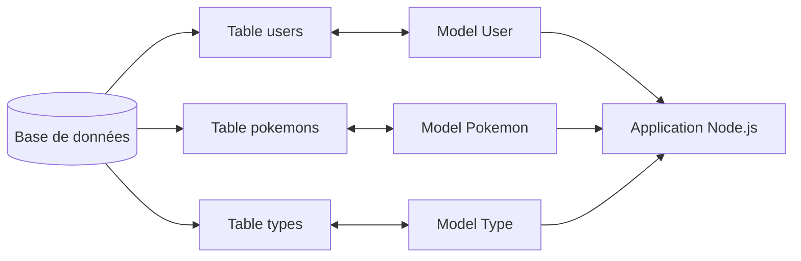

# Sequelize

## Introduction

Sequelize est un ORM pour Node.js.

ORM signifie **Object Relational Mapping**.

Un ORM permet de manipuler une base de données avec des objets JavaScript au lieu d’écrire constamment du SQL brut.

Sequelize prend en charge plusieurs systèmes de base de données :

* MariaDB
* MySQL
* PostgreSQL
* SQLite
* MSSQL

---

# Installation

Installez Sequelize ainsi que le driver correspondant à votre base de données.

Avec MariaDB :

```bash
npm install sequelize
npm install mariadb
```

---

# Initialisation de Sequelize

```js
const { Sequelize } = require('sequelize')

const sequelize = new Sequelize(
  'pokedex', // nom de la base de données
  'root', // nom d'utilisateur
  '', // mot de passe
  {
    host: 'localhost', // emplacement du serveur SQL
    dialect: 'mariadb', // moteur de base de données
    timezone: '+02:00',
    logging: false // désactive certains logs SQL dans la console
  }
)
```

---

# Comprendre le constructeur Sequelize

Le constructeur `Sequelize` reçoit **4 paramètres** :

```js
new Sequelize(database, username, password, options)
```

| Paramètre  | Description               |
| ---------- | ------------------------- |
| `database` | Nom de la base de données |
| `username` | Nom de l’utilisateur SQL  |
| `password` | Mot de passe SQL          |
| `options`  | Objet de configuration    |

---

# Explication des options

## host

La propriété `host` indique où se trouve votre base de données.

Exemple :

```js
host: 'localhost'
```

`localhost` signifie que la base de données tourne sur votre propre machine.

Dans un serveur distant, le host peut être :

```js
host: '192.168.1.10'
```

ou :

```js
host: 'db.monserveur.com'
```

---

## dialect

Le `dialect` représente le système de gestion de base de données utilisé.

Exemples :

```js
dialect: 'mariadb'
```

ou :

```js
dialect: 'mysql'
```

Sequelize supporte notamment :

* `mariadb`
* `mysql`
* `postgres`
* `sqlite`
* `mssql`

---

## timezone

Permet de gérer le fuseau horaire utilisé par Sequelize.

```js
timezone: '+02:00'
```

---

## logging

Permet d’activer ou désactiver les logs SQL dans la console.

```js
logging: false
```

Si vous mettez :

```js
logging: true
```

Les requêtes SQL seront affichées dans la console.

Pratique pour le debug. Très pratique aussi pour transformer votre terminal en roman SQL illisible de 400 lignes. Tradition sacrée du backend.

---

# Connexion à la base de données

```js
sequelize.authenticate()
  .then(() => {
    console.log('Connexion réussie à la base de données.')
  })
  .catch(error => {
    console.error('Impossible de se connecter à la base de données :', error)
  })
```

La méthode `authenticate()` permet de tester la connexion à la base de données.

Elle vérifie que :

* le serveur SQL fonctionne ;
* les identifiants sont corrects ;
* Sequelize peut communiquer avec la base de données.

---

# Version moderne avec async/await

```js
async function initDatabase() {
  try {
    await sequelize.authenticate()
    console.log('Connexion réussie à la base de données.')
  } catch (error) {
    console.error('Erreur de connexion :', error)
  }
}

initDatabase()
```

Cette approche est aujourd’hui plus utilisée dans les projets modernes Node.js, NestJS ou Next.js.

---

# Comment fonctionne Sequelize ?

Sequelize utilise des modèles (`Models`).

Un modèle représente une table dans la base de données.

Exemple :

| Table SQL | Modèle Sequelize |
| --------- | ---------------- |
| users     | User             |
| pokemons  | Pokemon          |
| types     | Type             |

---

# Schéma de fonctionnement avec Mermaid



---

# Création d’un modèle

Exemple avec un modèle `Pokemon` :

```js
const { DataTypes } = require('sequelize')

const Pokemon = sequelize.define('Pokemon', {
  name: {
    type: DataTypes.STRING,
    allowNull: false
  },

  hp: {
    type: DataTypes.INTEGER,
    defaultValue: 50
  }
})
```

---

# Explication

## sequelize.define()

Permet de créer un modèle.

```js
sequelize.define('Pokemon', {})
```

---

## DataTypes

`DataTypes` représente les différents types SQL disponibles.

Exemples :

| Sequelize           | SQL      |
| ------------------- | -------- |
| `DataTypes.STRING`  | VARCHAR  |
| `DataTypes.INTEGER` | INTEGER  |
| `DataTypes.BOOLEAN` | BOOLEAN  |
| `DataTypes.DATE`    | DATETIME |

---

## allowNull

```js
allowNull: false
```

Empêche qu’une valeur soit vide (`NULL`).

---

## defaultValue

```js
defaultValue: 50
```

Définit une valeur par défaut.

---

# Synchronisation avec la base de données

```js
sequelize.sync()
  .then(() => {
    console.log('Base synchronisée.')
  })
```

`sync()` permet de créer automatiquement les tables manquantes dans la base de données.

---

# Résumé

Sequelize permet :

* de connecter Node.js à une base de données ;
* de manipuler les tables avec JavaScript ;
* de créer des modèles ;
* d’éviter d’écrire du SQL brut en permanence ;
* de structurer proprement une application backend.

