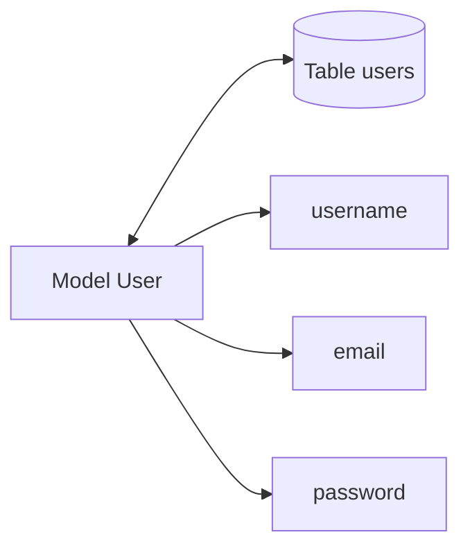

# Le principe d’un Model dans Sequelize

Un `Model` dans Sequelize représente une **table** dans la base de données.

Pense au modèle comme à un plan de fabrication.

---

# Relation entre Model et Table

| Sequelize       | Base de données  |
| --------------- | ---------------- |
| Model `User`    | Table `users`    |
| Model `Pokemon` | Table `pokemons` |
| Model `Article` | Table `articles` |

Le modèle sert donc à :

* définir la structure ;
* définir les colonnes ;
* définir les types ;
* définir les règles ;
* manipuler les données avec JavaScript.

---

# Exemple simple

```js id="2x9fsa"
const User = sequelize.define('User', {
  username: DataTypes.STRING,
  age: DataTypes.INTEGER
})
```

Ici :

* `User` → nom du modèle ;
* Sequelize va créer une table `users` ;
* `username` et `age` deviennent des colonnes SQL.

---

# Ce que Sequelize fait automatiquement

Quand tu écris :

```js id="6cbgj0"
sequelize.define('User', {})
```

Sequelize :

1. crée un modèle JavaScript ;
2. associe ce modèle à une table SQL ;
3. transforme automatiquement le nom au pluriel ;
4. ajoute souvent :

   * `id`
   * `createdAt`
   * `updatedAt`

par défaut.

---

# Schéma mental



---

# Le nommage des Models

## Convention recommandée

Les modèles sont généralement :

* au singulier ;
* en PascalCase.

Exemple :

```js id="b0w6sh"
User
Pokemon
BlogArticle
CustomerOrder
```

---

# Pourquoi au singulier ?

Parce qu’un modèle représente une entité unique.

Exemple :

```js id="n2tywh"
User
```

représente :

> “un utilisateur”

Même si la table contient plusieurs lignes.

La table SQL, elle, représente une collection :

```txt id="sh6wnv"
users
```

---

# Ce que Sequelize fait automatiquement

```js id="q0jv0m"
sequelize.define('User', {})
```

devient :

```txt id="wn32q5"
users
```

Automatiquement.

Même chose :

```js id="ahux8d"
sequelize.define('Pokemon', {})
```

devient :

```txt id="0ph49r"
pokemons
```

---

# Cas particulier : désactiver le pluriel

Tu peux empêcher Sequelize de transformer le nom :

```js id="vzbuxj"
sequelize.define('User', {}, {
  freezeTableName: true
})
```

Dans ce cas :

| Model | Table |
| ----- | ----- |
| User  | User  |

Sans transformation.

---

# Les attributs du modèle

Chaque propriété devient une colonne SQL.

```js id="f6l95w"
const User = sequelize.define('User', {
  username: DataTypes.STRING,
  age: DataTypes.INTEGER,
  isAdmin: DataTypes.BOOLEAN
})
```

Correspond à :

| Colonne SQL | Type    |
| ----------- | ------- |
| username    | VARCHAR |
| age         | INTEGER |
| isAdmin     | BOOLEAN |

---

# Les conventions importantes

## 1. PascalCase pour les modèles

```js id="2d3z9z"
User
BlogPost
CustomerOrder
```

Pas :

```js id="upv0nd"
user
blog_post
```

---

## 2. camelCase pour les propriétés

```js id="sh3ns5"
firstName
lastName
createdAt
```

Pas :

```js id="h56jow"
first_name
LASTNAME
```

---

# Pourquoi ces conventions existent ?

Parce qu’elles rendent le code lisible et cohérent.

Quand tu arrives sur un gros projet :

```js id="jlwmg1"
User.findAll()
Order.create()
Product.update()
```

tu comprends immédiatement :

* `User`
* `Order`
* `Product`

sont des modèles.

Sans conventions, un projet devient une jungle tropicale codée sous stress. Et après trois mois, même le développeur original ne comprend plus son propre backend. Phénomène extrêmement répandu dans l’écosystème JavaScript. Presque artistique.

---

# Instance d’un modèle

Quand tu récupères une donnée :

```js id="xtjlwm"
const user = await User.findByPk(1)
```

`user` devient une instance du modèle.

Tu peux ensuite faire :

```js id="b9y4oo"
console.log(user.username)
```

ou :

```js id="cc4n52"
await user.update({
  age: 22
})
```

---

# Différence importante

| Élément  | Rôle                          |
| -------- | ----------------------------- |
| Model    | Structure générale            |
| Instance | Une ligne précise de la table |

---

# Exemple concret

Table :

| id | username |
| -- | -------- |
| 1  | Orssi    |
| 2  | Delvin   |

Le modèle :

```js id="mjlwm0"
User
```

Une instance :

```js id="lq76k4"
{
  id: 1,
  username: "Orssi"
}
```

---

# Sequelize ajoute souvent automatiquement

Par défaut Sequelize crée :

```txt id="jlwm8t"
id
createdAt
updatedAt
```

Exemple :

| id | username | createdAt | updatedAt |
| -- | -------- | --------- | --------- |
| 1  | Orssi    | ...       | ...       |

---

# Désactiver les timestamps

```js id="tx56r0"
sequelize.define('User', {}, {
  timestamps: false
})
```

---

# Résumé rapide

| Concept    | Explication                       |
| ---------- | --------------------------------- |
| Model      | Représente une table              |
| Instance   | Représente une ligne              |
| define()   | Crée un modèle                    |
| DataTypes  | Définit les types SQL             |
| PascalCase | Convention des modèles            |
| camelCase  | Convention des propriétés         |
| Sequelize  | Met souvent les tables au pluriel |

Et comprendre ça change énormément de choses. Parce qu’au début les gens pensent que Sequelize “stocke des objets magiques”. Non. Derrière le rideau, il y a juste SQL qui transpire très fort pendant que JavaScript fait semblant d’être élégant.
